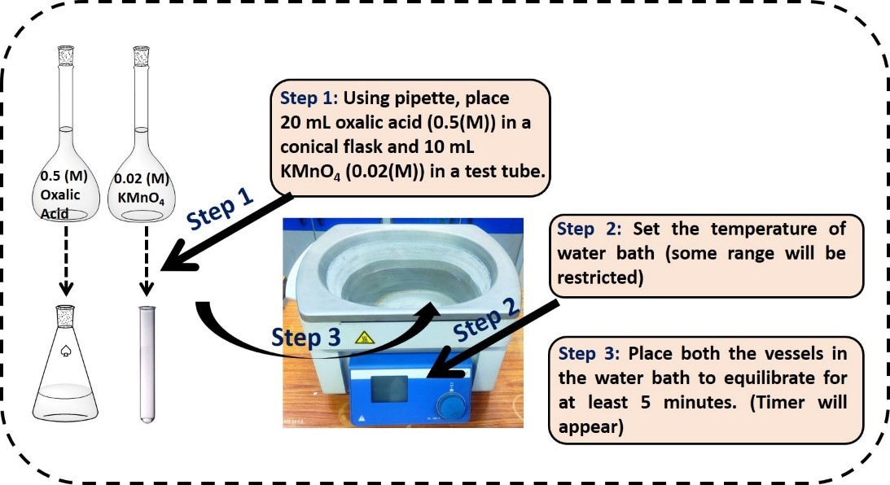
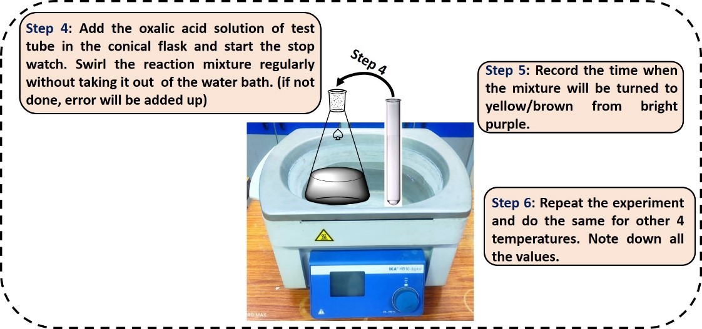
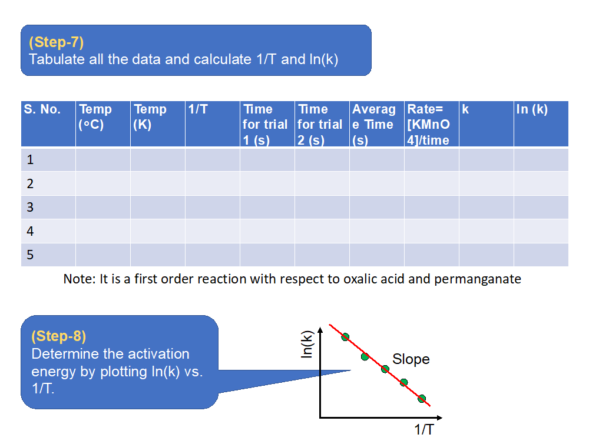
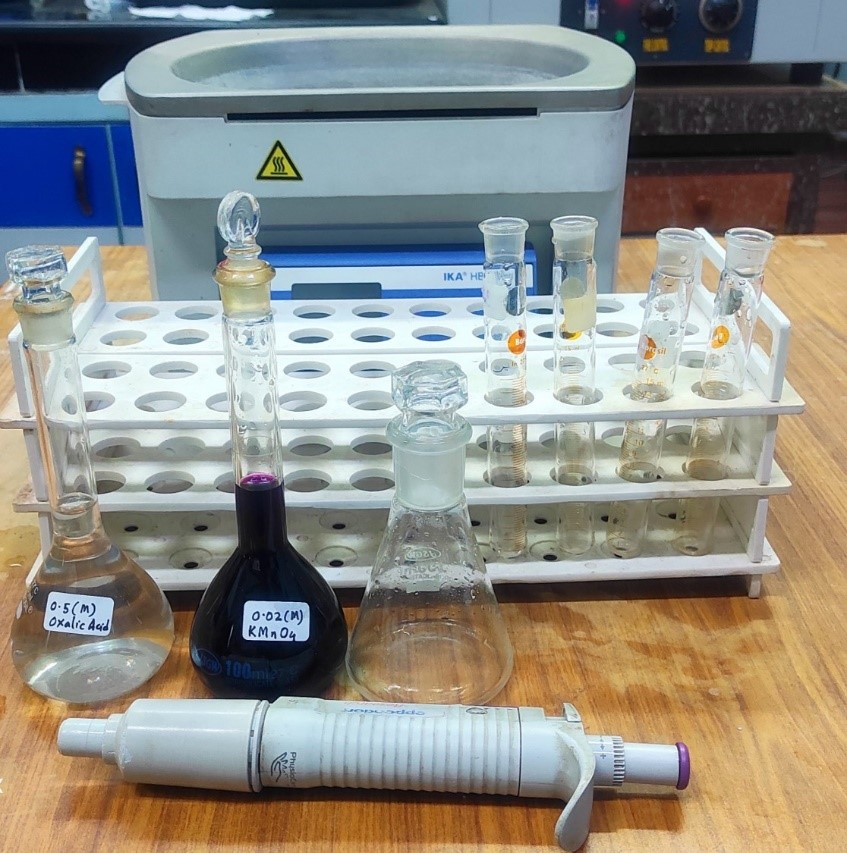
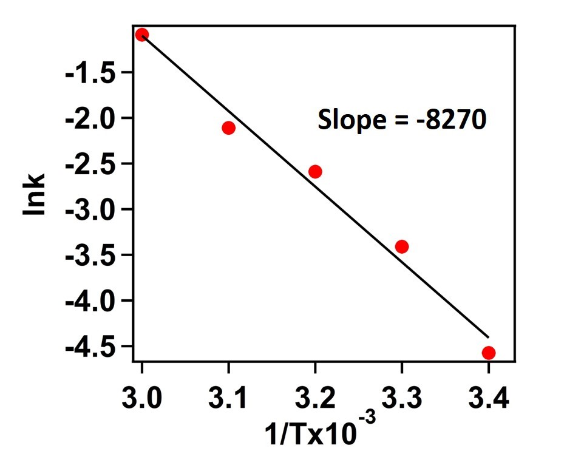

<b>Materials & Reagents Required: </b>

1)  Temperature controlled water bath.
2)	Volumetric flask (250 ml)
3)	Conical flask (250 ml)
4)	Test tubes
5)	Micropipette (5 ml)

<b>Procedure in laboratory (diagram)</b> 
 
 
 

  

 

 
<b>Procedure in laboratory</b> 
 

 
<b>Data and the analysis:</b>
 
After mixing 20 mL, 0.5(M) oxalic acid with 0.02(M) KMnO4,  
The Concentration of KMnO4 becomes = 0.0067 (M) 
The Concentration of Oxalic acid becomes = 0.33 (M) 
 
We have calculated the rate by using following equation 
Rate= [KMnO4]/time 

Next, we have measured rate constant (k) by using following equation 
k = rate / [KMnO4] [Oxalic Acid] 

 
 

 
Therefore, 
Slope = -Ea/R = - 8270 K
Then Ea  E(a )=(8270 K ×R)
=(8270 K×8.314 J 〖mol〗-1 K-1 )
= 68.75 kJ 〖mol〗-1
 
<b>Activation Energy for this chemical reaction = 68.75 kJ mol-1</b>
 
<b>Analysis</b>
 
Therefore,  
Slope = -Ea/R = - 8270 K 
Then Ea  Ea =(8270 K ×R) 
=(8270 K×8.314 J 〖mol〗-1 K-1 ) 
= 68.75 KJ 〖mol〗^(-1)

