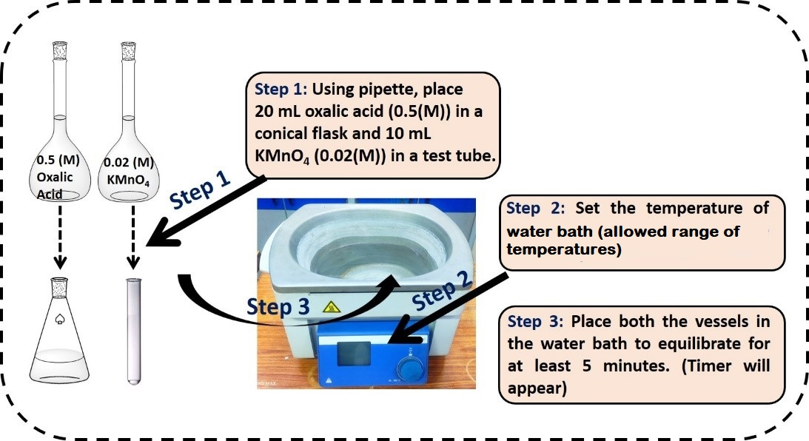
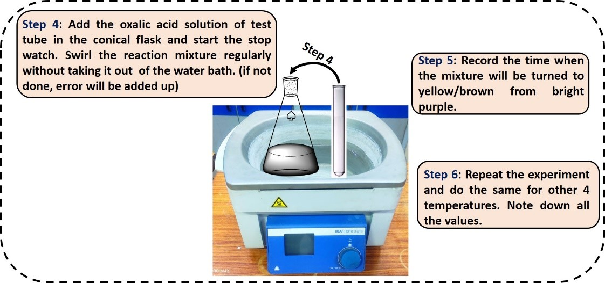
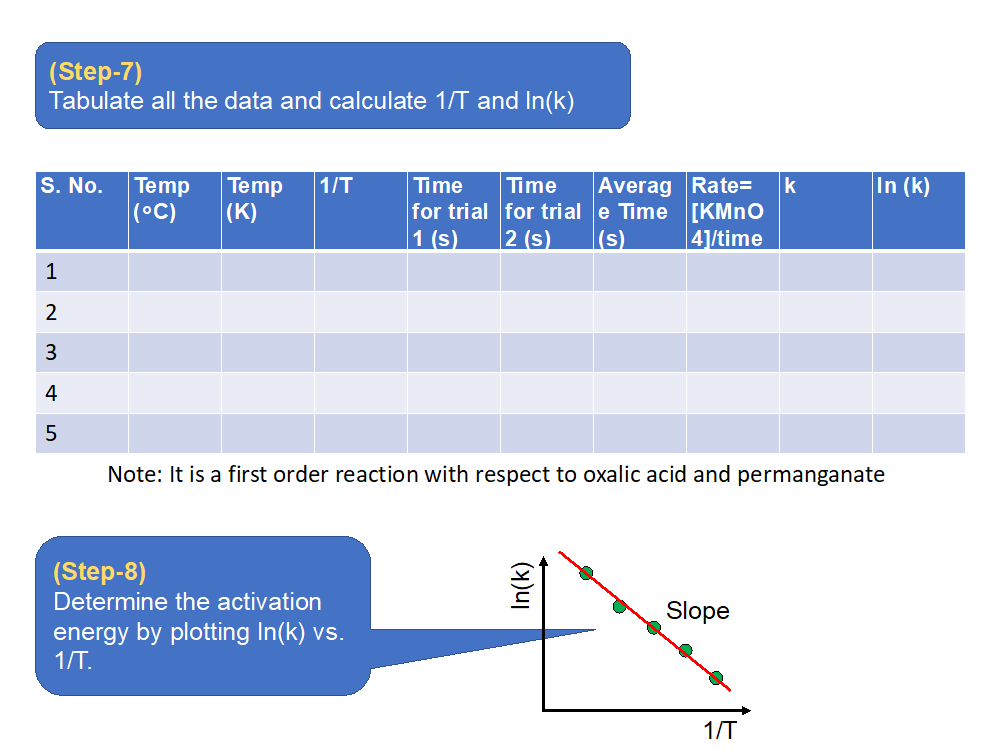
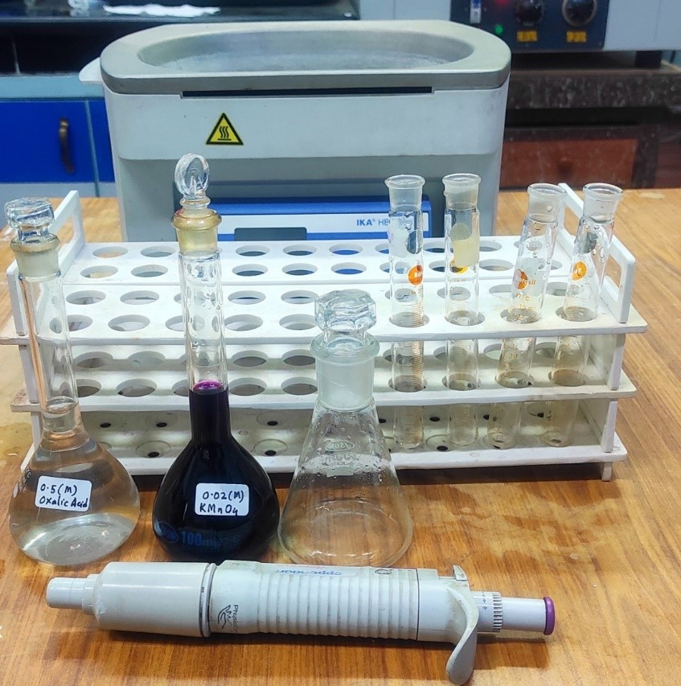
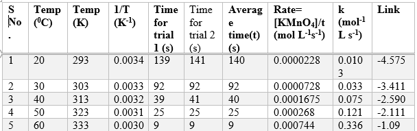
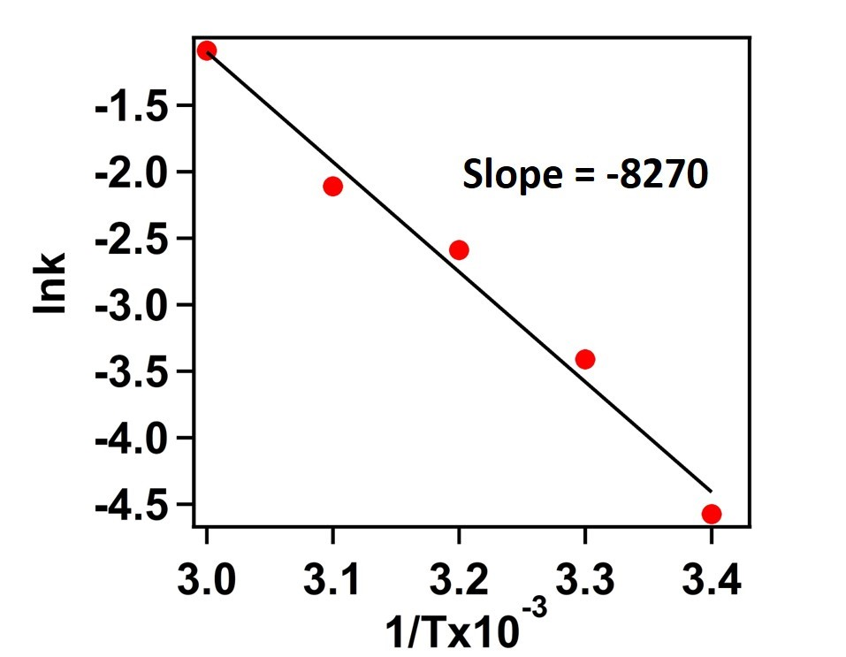

1.	Prepare 0.5 M oxalic acid and 0.02 M KMnO4 in a cleaned suitable volumetric flask. Pipette out 20 mL of oxalic acid and 10 ml of KMnO4 in a conical flask and a test tube respectively.  
2.	Set the temperature of water bath up to the allowed range and place both the vessels into the water bath. Allow a 5 min equilibrium time for both of them.  
3.	Add the oxalic acid into the conical flask and start the stop watch to record time.  
4.	Swirl the reaction mixture regularly keeping it to the water bath.  
5.	Pause and record the time of the stop watch when the reaction mixture turned to purple from yellow/brown (completion of reaction).  
6.	Repeat the same procedure for 4 other temperatures and determine the activation energy of the reaction.  

<b>Materials & Reagents Required: </b>

1)  Temperature controlled water bath.
2)	Volumetric flask (250 ml)
3)	Conical flask (250 ml)
4)	Test tubes
5)	Micropipette (5 ml)

<b>Procedure in laboratory (diagram)</b> 
 
 
 

  

 

 
<b>Procedure in laboratory</b> 
 

 
<b>Data and the analysis:</b>
 
After mixing 20 mL, 0.5(M) oxalic acid with 0.02(M) KMnO4,  
The Concentration of KMnO4 becomes = 0.0067 (M) 
The Concentration of Oxalic acid becomes = 0.33 (M) 
 
We have calculated the rate by using following equation 
Rate= [KMnO4]/time 

Next, we have measured rate constant (k) by using following equation 
k = rate / [KMnO4] [Oxalic Acid] 

 
 

 
Therefore, 
Slope = -Ea/R = - 8270 K
Then Ea  E(a )=(8270 K ×R)
=(8270 K×8.314 J 〖mol〗-1 K-1 )
= 68.75 kJ 〖mol〗-1
 
<b>Activation Energy for this chemical reaction = 68.75 kJ mol-1</b>
 
<b>Analysis</b>
 
Therefore,  
Slope = -Ea/R = - 8270 K 
Then Ea  Ea =(8270 K ×R) 
=(8270 K×8.314 J 〖mol〗-1 K-1 ) 
= 68.75 KJ 〖mol〗^(-1)

