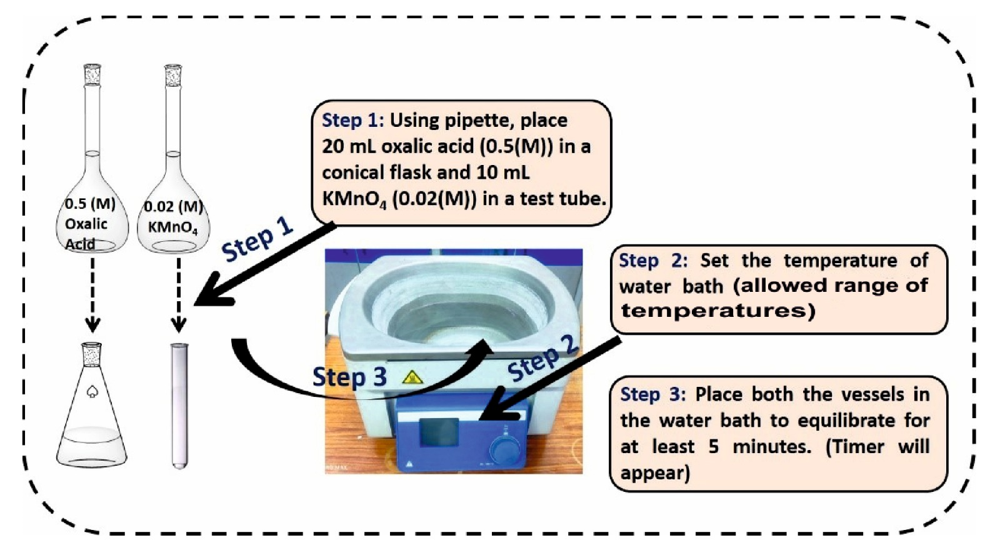

<b>Theory of the Experiment:</b>
 
 In 1889, Arrhenius demonstrated that the rate constant of a chemical reaction varies with temperature. For a given reaction, the rate constant k is related to the temperature of the system by the Arrhenius equation
<!-- 

   -->
k=Ae-Ea/RT				   (1) 

where R is the ideal gas constant, T is the temperature in Kelvin, Ea is the activation energy and A is a constant called the frequency factor, which is related to the frequency of collisions between reactants. Taking natural logarithm of the above equation we get 

ln⁡k=-Ea/RT+ ln ⁡A				(2) 

Thus, a plot of ln k vs 1/T yiels a straight line with negative slope = –Ea/R  

The activation energy of a reaction is the amount of energy required to initiate the reaction. It represents the minimum energy needed to form an activated complex during collisions between reactant molecules.
  

The factor e^{-Ea/RT} represents the fraction of molecular collisions with the correct orientation that have sufficient energy to form the activated complex. 

In slow reactions, this fraction is low and most of the collisions are unsuccessful for the reaction. Increasing the temperature leads to an increase in this fraction and an increase in the rate constant. 

In this experiment, a reaction between potassium permanganate and dilute oxalic acid will be carried out at different temperatures. The permanganate ion is converted to MnO2 in this reaction. The rate constant (k) is measured at different temperatures and lnk is plotted against (1/T) to determine Activation energy (Ea). Given that the reaction is first order in permangate and oxalate, the rate constant can be measured by measuring the completion time of the reaction, which is accompanied by a change in colour from deep purple to light brown. 

